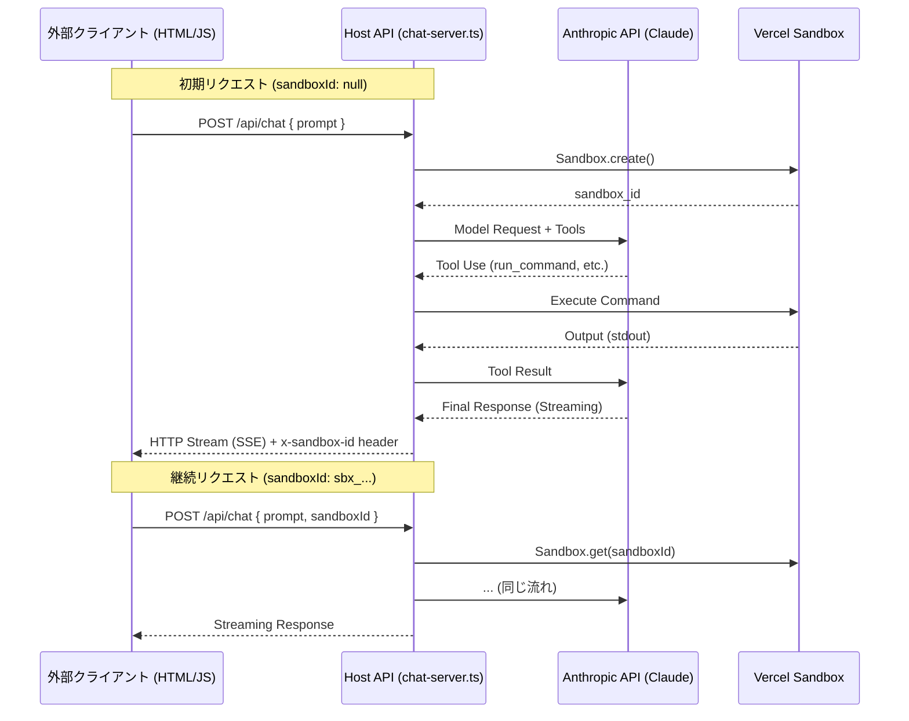

# Vercel Sandbox + Claude Agent Integration POC

このプロジェクトは、Vercel Sandbox 内で自律的に動作する AI エージェントを構築・運用するための POC です。
Vercel AI SDK v6 を使用し、ストリーミング形式でのツール実行とチャット UI を実現しています。

## 1. アーキテクチャ

以下は、外部のウェブページから `chat-server.ts` (Host API) を経由して、Vercel Sandbox 上のエージェントと対話する。



## 2. 準備

1. 依存関係のインストール:
   ```bash
   npm install
   ```

2. 環境変数の設定: `.env.local` を作成し、以下を設定します。
   ```text
   ANTHROPIC_API_KEY=your_api_key_here
   ```

## 3. 使い方

### A. CLI エージェント (`agent.ts`)
ターミナルから直接エージェントを動かすためのスクリプトです。

**実行方法:**
```bash
node --env-file .env.local --experimental-strip-types ./agent.ts "株式会社CAPERについて調べて、結果をファイルに保存して"
```
- **特徴**: 1つのプロンプトに対して完結するまで自律的にツールを実行し続けます。
- **後処理**: タスク完了後に自動的に Sandbox を `stop()` します。

---

### B. ストリーミング・チャットサーバ (`chat-server.ts`)
外部フロントエンド（ウェブブラウザ等）から利用するためのストリーミングサーバーです。

**実行方法:**
```bash
PORT=8080 npx tsx chat-server.ts
```

**利用手順:**
1. サーバー起動後、ブラウザで [http://localhost:8080](http://localhost:8080) を開きます。
2. チャット形式でエージェントと対話できます。
3. `agent.ts` と同じフル機能のツール（Web検索、ファイル操作、コマンド実行）が利用可能です。

## 4. 主な機能

- **Web Search/Fetch**: Anthropic の最新ベータ機能を利用したウェブ情報の取得
- **VCPUs/Memory**: `resources: { vcpus: 2 }` による高性能な Sandbox 実行
- **Host API Pattern**: サーバーサイドで安全に Sandbox と API キーを管理
- **Streaming UI**: Vercel AI SDK v6 による低遅延なリアルタイム応答
